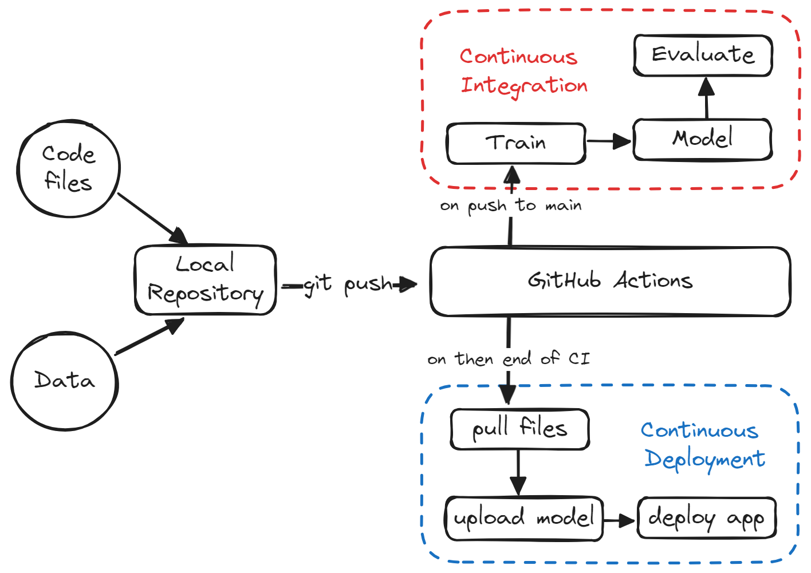
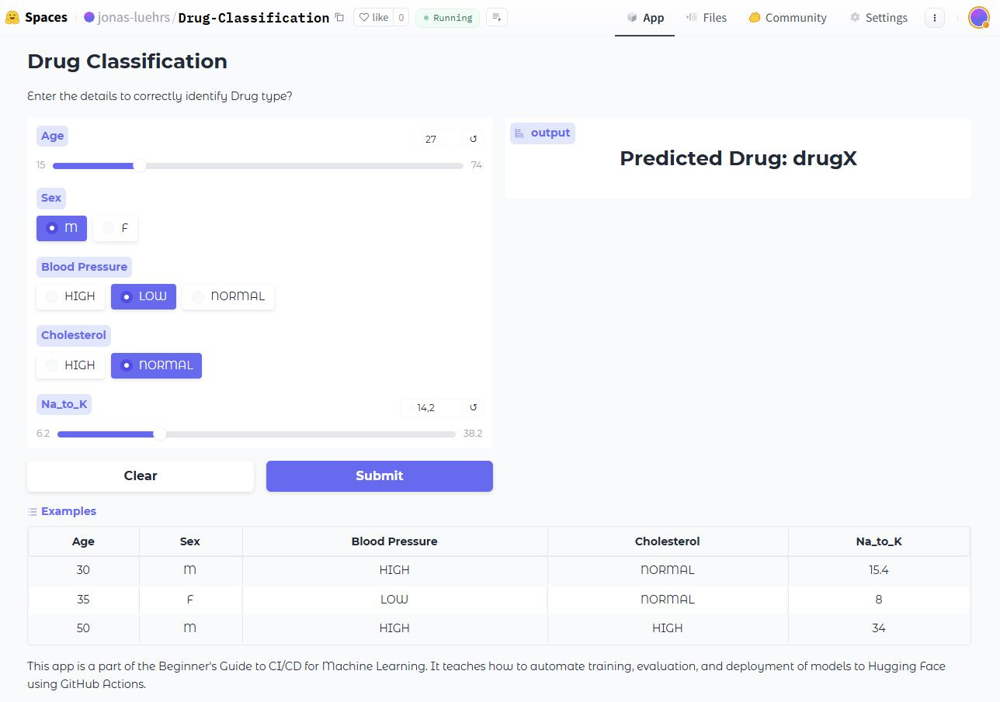

# CI/CD for Machine Learning
[](https://github.com/JonasLuehrs/CICD-for-Machine-Learning/actions/workflows/ci.yml)
[](https://github.com/JonasLuehrs/CICD-for-Machine-Learning/actions/workflows/cd.yml)

A beginner's project on "Automating Training, Evaluation, and Deploying Models using GitHub Actions" provided by [Abid Ali Awan](https://github.com/kingabzpro) and [datacamp](https://www.datacamp.com/).

Tutorial: https://www.datacamp.com/tutorial/ci-cd-for-machine-learning

Original repository: https://github.com/kingabzpro/CICD-for-Machine-Learning

## Project Description
This project trains a random forest algorithm with [scikit-learn](https://scikit-learn.org/1.5/index.html) pipelines to build a drug classifier. The evaluation is done automatically using [CML](https://cml.dev/) (Continuous Machine Learning). A web application is build with [gradio](https://www.gradio.app/) and deployed on the [Hugging Face Hub](https://huggingface.co/spaces). 

From training to evaluation, the entire process is automated using [GitHub actions](https://github.com/features/actions). Pushing code to the GitHub repository will trigger the training, evaluation and deployment, leading to an updated web application, model, and results on Hugging Face (see https://huggingface.co/spaces/jonas-luehrs/Drug-Classification).

The Makefile includes commands to install Python packages (install), format code (format), train scripts (train), and generate CML reports (eval), push the updated model and results to the "update" branch (update-branch), and upload the new model, results, and gradio app to the Hugging Face space (deploy).


## Dataset
[Drug Classification](https://www.kaggle.com/datasets/prathamtripathi/drug-classification)

## CI/CD Pipeline



## Web Application



## Pre-Commit Hooks
The code quality is checked with pre-commit hooks. To install the pre-commit hooks run the following command.
This is used to ensure that the code quality is consistent and that the code is formatted uniformly.
````
pip install pre-commit
pre-commit install
````
This will install the pre-commit hooks in your local repository. The pre-commit hooks will run automatically before each commit. If the hooks fail the commit will be aborted. You can skip the pre-commit hooks by adding the `--no-verify` flag to your commit command.

The installed pre-commit hooks are:
- [`black`](https://github.com/psf/black) - Code formatter (Line length 100)
- [`flake8`](https://github.com/PyCQA/flake8) Code linter (Selected rules)
- [`isort`](https://github.com/PyCQA/isort) - Import sorter
